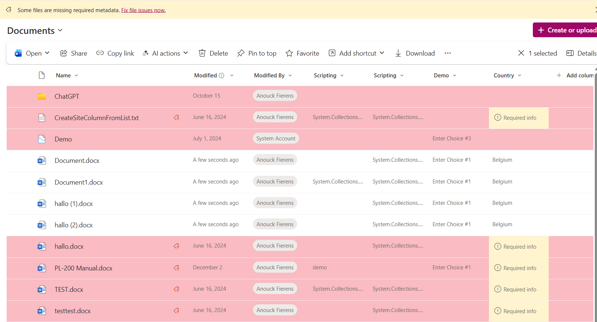

# Multilingual Quotes

## Summary

This sample demonstrates how to use SharePoint View Formatting to highlight entire rows when a Managed Metadata field is empty.
Because the default conditional formatting doesn’t support Managed Metadata columns, this JSON uses the length operator to detect empty values and applies a red (coral) background to the row. It also forces all text to black for readability.

This is useful when you want to visually flag missing required metadata and guide users to complete their items.

## View requirements

|Type                |Internal Name|Required| Multiple answers |
|--------------------|-------------|:------:| -----------------|
|Single line of text |Title        |Yes     |                  |
|Single line of text |Name         |Yes     |                  |
|Managed Metadata    |Country      |Yes     |Yes

## Sample

Solution|Author(s)
--------|---------
mm-highlight-empty.json | [Anouck Fierens](https://github.com/AnouckF/AnouckF)

## Version history

Version |Date               |Comments
--------|-------------------|--------------------------------
1.0     |December 10, 2025  |Initial release

## Disclaimer
**THIS CODE IS PROVIDED *AS IS* WITHOUT WARRANTY OF ANY KIND, EITHER EXPRESS OR IMPLIED, INCLUDING ANY IMPLIED WARRANTIES OF FITNESS FOR A PARTICULAR PURPOSE, MERCHANTABILITY, OR NON-INFRINGEMENT.**